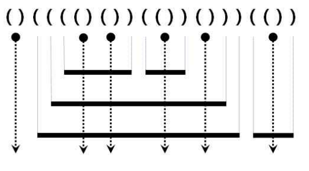

### 스택/큐 응용 - 쇠막대기

[프로그래머스 링크](https://programmers.co.kr/learn/courses/30/lessons/42585)

 

#### 예제 그림

 

#### 문제 설명

- 쇠막대기는 자신보다 긴 쇠막대기 위에만 놓일 수 있습니다.
- 쇠막대기를 다른 쇠막대기 위에 놓는 경우 완전히 포함되도록 놓되, 끝점은 겹치지 않도록 놓습니다.
- 각 쇠막대기를 자르는 레이저는 적어도 하나 존재합니다.
- 레이저는 어떤 쇠막대기의 양 끝점과도 겹치지 않습니다.

(a) 레이저는 여는 괄호와 닫는 괄호의 인접한 쌍 '()'으로 표현합니다. 또한 모든 '()'는 반드시 레이저를 표현합니다.

(b) 쇠막대기의 왼쪽 끝은 여는 괄호 '('로, 오른쪽 끝은 닫힌 괄호 ')'로 표현됩니다.

 

#### 입출력 예

|arrangement|return|
|-----------|------|
|"()(((()())(())()))(())"|17|

 

#### 내 풀이

문제 설명이 더 혼동을 주는 것 같아서 **그림만 보고**! 문제를 이해하고 풀이를 해야겠다고 생각함.

**내가 생각한 문제의 이해**

- 일단 입력값은 '('와 ')' 밖에는 없다.
- '()'이면 레이저가 생겨 쇠막대기를 자를 것이다.
- '(' 2개 이상부터 쇠막대기는 1개씩 증가한다.
- 앞에와는 반대로 ')' 2개 이상부터 쇠막대기는 1개씩 감소한다.

**문제 해결 접근**

- 입력된 문자열을 쪼개고 순회하여 문자들을 체크
- **'('는 막대기 수 증가, ')'는 막대기 수 감소**
- 레이저가 생성되면 생성된 막대기만큼 잘릴 막대기가 증가
  - 2개의 막대기 생성된 뒤 레이저가 나올 때 잘리는 막대기는 2개(잘린 뒤의 남는 막대기는 나중에 처리)
- 순회할 때 **이전 문자와 현재 문자가 계속 비교**되어야 함.
  - 스택이용 : Top과 Input을 계속 비교
- ')'가 2개 이상이 되면 쇠막대기가 감소, 이때 잘리는 것이 끝나는 막대기이므로 잘린 막대기 갯수에 +1을 해야한다.(한 막대기에 2개의 레이저를 쏘면 3개로 쪼개짐)
- '('가 나오면 생성된 막대기 변수를 증가시키되 2개 이상부터 막대기가 생기므로 ')'가 나왔을 때 생성된 막대기 변수를 감소시킨 후 **잘린 막대기 갯수 += 생성된 막대기 갯수**를 수행한다.

글로만 봐서는 이해하기 힘들어 표로 정리

**Top과 Input을 비교, 결과값을 예측해보는 표 작성**

- 스택에는 값을 무조건 push!

|TOP|INPUT|결과|
|:-:|:---:|:--|
|NULL|'(' |막대기수 +1|
|NULL|')' |x(나오면 error)|
|'('|'(' |막대기수 +1|
|'('|')' |막대기수 -1 -> 결과값 += 막대기수(레이저)|
|')'|'(' |막대기수 +1|
|')'|')' |막대기수 -1 -> 결과값 +1|

 

#### 소스 코드

~~~java
import java.util.Stack;

/*
    맨처음 문자가 ')'이 들어가는 입력값은 예외처리 하지 않음.
*/

public class StealBar_algorithm {
	
	private static int solution(String arrangement) {
		int answer = 0;     // 잘린 막대기 갯수(결과값)
		int add_stealbar = 0;   // 생성된 막대기
		Stack<Character> stack = new Stack<>();
		
		for(char input : arrangement.toCharArray()) {
			if(stack.isEmpty()) {   // TOP: NULL, Input: '('
				stack.push(input);
				add_stealbar++;
			} else {
				char top = stack.peek();
				if(input == '(') {  // top의 값과 상관없이 input이 '('면 막대기 추가
					stack.push(input);
					add_stealbar++;
				} else {
					if(top == '(') {  // 레이저
						stack.push(input);
						add_stealbar--;
						answer += add_stealbar;
					} else {    // 막대기 감소
						stack.push(input);
						add_stealbar--;
						answer++;
					}
				}
			}
		}
		
        return answer;
    }

	public static void main(String[] args) {
		// TODO Auto-generated method stub
		int n = solution("()(((()())(())()))(())");
		System.out.println("Answer : " + n);
	}

}

-> Answer : 17

~~~